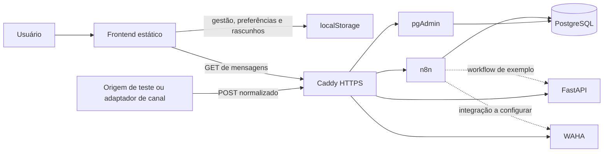

# Arquitetura

## Dois caminhos de dados

Linhas pontilhadas indicam integração experimental/a configurar. A FastAPI não é a API de gestão do app; WAHA não está conectado ao composer por código versionado. Caddy não serve o frontend neste Compose.

## Frontend

`frontend/socialmei-app.html` é a fonte de markup. Os scripts clássicos são carregados em ordem, nas mesmas posições da versão aprovada. Algumas funções e variáveis são compartilhadas globalmente; trocar para `defer`, `async` ou módulos ES sem revisar a inicialização pode quebrar esse contrato.

- `storage-and-themes.js` e `motion.js` inicializam tema e movimento antes da interface.
- `inbox.js`, `inbox-sync.js`, `dialogs.js` e `navigation.js` cuidam do atendimento e do shell.
- `business-views.js` renderiza os módulos de gestão; helpers menores ficam em `sales.js`, `finance.js`, `customers.js` e `products.js`.
- `app.js` reúne dados demonstrativos, estado, utilitários, eventos e inicialização.
- `experience.js` ainda concentra landing/auth/onboarding, Home, Assistente e automações locais.
- `record-editor.js` integra edição/confirmação e persistência de rascunhos.

A extração separou responsabilidades em arquivos; não eliminou todos os acoplamentos internos. `frontend/styles/socialmei.css` preserva a cascata, com seções e media queries próximas dos componentes.

### Persistência e compatibilidade

`socialmei-app-data-v2` guarda financeiro, vendas, clientes, produtos e preferências; `socialmei-inbox-local-v3` guarda estado local do atendimento. Perfil da experiência, temas e regras têm chaves próprias. O backup JSON reúne chaves `socialmei-`/`socialmei_`, com validação antes da importação.

Campos como `clientes`, `nome` e `mensagem`, IDs existentes e classes antigas são contratos preservados. Novos nomes internos usam inglês; renomear dados persistidos exige migração. `sessionData` contém conversas/atividade de demonstração e não é uma fonte compartilhada entre usuários.

## Caixa Unificada e n8n

O app consulta `frontend/config.js`, faz GET e espera `{ "mensagens": [...] }`. O intervalo progride de 4 para 8, 15 e 30 segundos quando não há novidades/ocorrem falhas; pausa com aba oculta, offline ou fora da experiência do app. A opção `since` permanece desligada porque o SQL versionado não implementa esse filtro.

O export `n8n-workflows/producao/01-caixa-unificada-api-postgresql.json` possui dois caminhos:

1. POST → normalização → SQL parametrizado → confirmação.
2. GET → leitura das últimas 50 mensagens de entrada → JSON com CORS `*` e `Cache-Control: no-store`.

A gravação faz upsert de cliente/conversa e insere mensagem. O frontend identifica conversas pelo nome/canal; o payload de leitura não inclui IDs estáveis de cliente/conversa. Reenvio de webhook não é deduplicado por ID externo na query de inserção. São limites para resolver antes de receber tráfego real.

Export inativo não significa workflow inativo na VPS: Git e ambiente remoto são estados separados. Credenciais precisam ser selecionadas após importar. Workflows experimentais de Instagram têm dependências Gemini/Meta e autenticação por credencial n8n; não são a IA do Assistente local.

## Banco

PostgreSQL 16 atende o banco interno do n8n e o schema funcional `socialmei` com `clientes`, `conversas`, `mensagens`. `bootstrap.sql` exige a role `socialmei_admin` previamente criada. `permissions.sql` prepara `socialmei_app`, sem senha versionada, e cita explicitamente o banco `n8n`.

Não há migrations de gestão, multiempresa ou montagem automática desses scripts. Os grants padrão pressupõem tabelas criadas por `socialmei_admin`. Veja [docs/BANCO-DE-DADOS.md](docs/BANCO-DE-DADOS.md).

## Infraestrutura

`compose.yaml` é a definição completa: PostgreSQL, n8n, pgAdmin, Caddy, FastAPI e WAHA. `compose.override.yaml` mantém compatibilidade sem redefinir serviços. Caddy publica 80/443; WAHA tem bind `127.0.0.1:3000`; PostgreSQL e FastAPI não publicam portas próprias.

Os hosts WAHA/FastAPI podem ser configurados por ambiente, com fallback para os endereços históricos. O hook histórico do WAHA aponta à raiz do n8n e precisa ser validado/mapeado ao adaptador de recebimento. Não há workflow versionado que prove o envio pelo composer.

O script `backup.sh` descobre o volume real do n8n, gera dump/configuração e arquiva dados do n8n com parada temporária. Não faz backup dos volumes WAHA/pgAdmin/Caddy, nem fornece snapshot atômico entre banco e arquivos.
