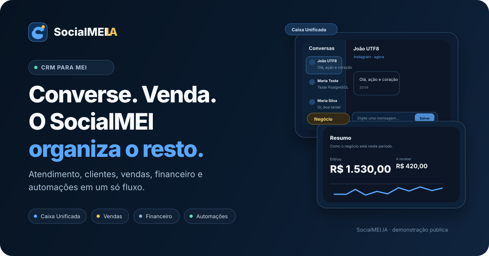

<p align="center">
  
</p>

<p align="center">
  <strong>CRM experimental para MEIs que conecta atendimento, clientes, vendas, financeiro, catálogo e automações em uma experiência única.</strong>
</p>

<p align="center">
  <a href="https://socialmei-ia.github.io/SocialMEI-IA/">Abrir demonstração</a>
  ·
  <a href="https://socialmei-ia.github.io/SocialMEI-IA/tools/mike-devhub.html">Mike DevHub</a>
  ·
  <a href="ARCHITECTURE.md">Arquitetura</a>
  ·
  <a href="ROADMAP.md">Roadmap</a>
  ·
  <a href="docs/QA.md">QA</a>
</p>

<p align="center">
  <code>HTML + CSS + JavaScript</code>
  <code>n8n</code>
  <code>PostgreSQL</code>
  <code>FastAPI</code>
  <code>Docker</code>
</p>

## Visão rápida

| 💬 Atendimento                                                                | 🧾 Gestão do negócio                                                                   | ⚡ Continuidade                                                            |
| ----------------------------------------------------------------------------- | -------------------------------------------------------------------------------------- | -------------------------------------------------------------------------- |
| Caixa Unificada com histórico, contexto do cliente, notas e rascunhos locais. | Clientes, vendas, catálogo e financeiro com CRUD, busca, filtros e indicadores locais. | Automações locais, Assistente contextual, relatórios, temas e backup JSON. |

> **Demonstração pública:** a experiência atual é intencionalmente honesta sobre seus limites. Login não autentica em servidor, o Assistente não chama um modelo de IA remoto e as rotinas não publicam workflows no n8n.

**Fonte oficial do frontend:** [`frontend/socialmei-app.html`](frontend/socialmei-app.html).  
`index.html` e `frontend/socialmei-dashboard.html` apenas encaminham para ela; não mantenha cópias paralelas da aplicação.

## Estado atual

| Área                                    | O que realmente existe                                                                                                                       |
| --------------------------------------- | -------------------------------------------------------------------------------------------------------------------------------------------- |
| Landing, cadastro, login e onboarding   | Experiência local. Login não autentica contra um servidor.                                                                                   |
| Home e Visão Geral                      | Contexto e indicadores locais; parte da atividade e dos gráficos é demonstrativa.                                                            |
| Clientes, vendas, financeiro e catálogo | CRUD, busca e filtros com `localStorage`.                                                                                                    |
| Caixa Unificada                         | Conversas demonstrativas, notas e rascunhos locais; leitura HTTP do n8n com recuo de 4 a 30 segundos. Respostas não são enviadas aos canais. |
| Assistente                              | Geração local de sugestões e inserção de rascunhos; nenhum modelo de IA conectado ao app.                                                    |
| Automações do app                       | Regras locais e execução simulada; não publicam workflows no n8n.                                                                            |
| Relatórios e configurações              | Resumos locais, CSV, temas claro/escuro/automático/custom e backup JSON.                                                                     |
| PostgreSQL e n8n                        | Schema e workflow de entrada/leitura versionados; precisam de configuração e validação no ambiente de destino.                               |
| API Python                              | FastAPI com `/`, `/health` e `/processar`: converte texto em maiúsculas e conta caracteres.                                                  |
| WAHA                                    | Serviço Compose para WhatsApp; sua conexão completa com a Caixa Unificada ainda precisa ser validada.                                        |

O Compose descreve infraestrutura; sua presença no Git não comprova disponibilidade online. O backend atual não oferece autenticação, API de gestão, isolamento entre negócios ou envio do composer.

## Começar a desenvolver

Para novos integrantes, o fluxo recomendado é:

```bash
git clone https://github.com/socialmei-ia/SocialMEI-IA.git
cd SocialMEI-IA
npm ci
npm run setup
npm run dev
```

Isso sobe um ambiente local isolado com frontend, PostgreSQL, n8n e FastAPI. Veja [docs/ONBOARDING.md](docs/ONBOARDING.md).

## Executar o frontend

Pré-requisitos: Git, Python 3 e navegador.

```bash
git clone https://github.com/socialmei-ia/SocialMEI-IA.git
cd SocialMEI-IA
python -m http.server 5500
```

Abra http://localhost:5500. Não há build nem dependências npm para servir a aplicação. Mantenha a pasta `frontend/` completa: o HTML carrega CSS, scripts e assets relativos. Dados ficam no navegador e podem ser exportados em **Configurações → Dados**.

O endpoint público de leitura está em [`frontend/config.js`](frontend/config.js). Rodar um servidor estático não cria o n8n. Não coloque segredos nesse arquivo.

## Estrutura

```text
index.html                         entrada GitHub Pages
frontend/
  socialmei-app.html               markup oficial
  socialmei-dashboard.html         entrada de compatibilidade
  config.js                       configuração pública
  scripts/                        lógica por responsabilidade
  styles/socialmei.css             tokens, componentes, telas e motion
  assets/                         ícone e fonte extraídos do HTML aprovado
python-service/                   API FastAPI e testes de contrato
database/                         bootstrap, schema e permissões
n8n-workflows/
  producao/                       entrada/leitura PostgreSQL, export inativo
  examples/                       testes Hello World e Python
  experimental/                   Instagram e rascunho agendado
tools/                            Mike DevHub, consulta operacional
tests/                            dados, temas, workflows, backup e navegador
docs/                             guias específicos e imagens
compose.yaml                      todos os seis serviços
compose.override.yaml             compatibilidade, sem serviços adicionais
Caddyfile                         proxy HTTPS
backup.sh                         backup privado; interrompe n8n temporariamente
```

## Tecnologias e arquitetura

HTML, CSS e JavaScript puro no navegador; Python/FastAPI/Uvicorn na API auxiliar; n8n, PostgreSQL 16, pgAdmin, WAHA e Caddy em Docker Compose. Node 22+ e Playwright são ferramentas de manutenção, não dependências de produção do site.

A gestão local não passa pelo PostgreSQL. Apenas o workflow de histórico versionado usa o schema `socialmei`. Veja [ARCHITECTURE.md](ARCHITECTURE.md).

## Testar

```bash
npm ci
npm test
npm run format:check
python -m pip install -r python-service/requirements.txt
python -m unittest discover -s python-service -p 'test_*.py'
python -m unittest discover -s tests -p 'test_*.py'
docker compose --env-file .env.example config --quiet
```

Regressão de navegador, com requisições externas bloqueadas:

```bash
npx playwright install chromium
npm run test:browser
```

A suíte serve o checkout temporariamente e cobre cadastro/onboarding, CRUD, Inbox, Assistente, regras locais, exportação/importação, login, sidebar, temas e 88 estados de módulos em quatro larguras. Não comprova integração real. O CI executa esses comandos e não faz deploy da VPS. Resultados desta revisão e limitações estão em [docs/QA.md](docs/QA.md).

## Infraestrutura e publicação

Para um ambiente próprio, copie `.env.example` para `.env`, configure senhas, domínios e DNS, valide o Compose e siga [DEPLOYMENT.md](DEPLOYMENT.md). O SQL e os workflows não são aplicados automaticamente. Não execute essa preparação sobre um banco existente como se fosse uma migração.

O frontend usa a raiz do repositório para GitHub Pages. Confira **Settings → Pages**; não existe workflow de publicação Pages ou deploy automático da VPS versionado aqui. Merge no ramo configurado pode publicar o site conforme as configurações do GitHub.

## Manutenção e próxima etapa

- [DEVELOPMENT.md](DEVELOPMENT.md): editar frontend, Python, SQL e workflows.
- [ARCHITECTURE.md](ARCHITECTURE.md): fluxos reais e limites de cada camada.
- [DEPLOYMENT.md](DEPLOYMENT.md): publicação, configuração e rollback.
- [PROJECT-REVIEW.md](PROJECT-REVIEW.md): mapa completo, divergências e dívida técnica.
- [ROADMAP.md](ROADMAP.md): prioridades da próxima fase.
- [CHANGELOG.md](CHANGELOG.md): mudanças de manutenção.
- [CONTRIBUTING.md](CONTRIBUTING.md) e [SECURITY.md](SECURITY.md): colaboração e acesso.
- [Mike DevHub](tools/mike-devhub.html): comandos de consulta; não executa serviços.

A próxima etapa é validar o fluxo n8n/PostgreSQL em ambiente isolado e definir autenticação e persistência da gestão. A interface atual deve continuar funcionando durante essa transição.
